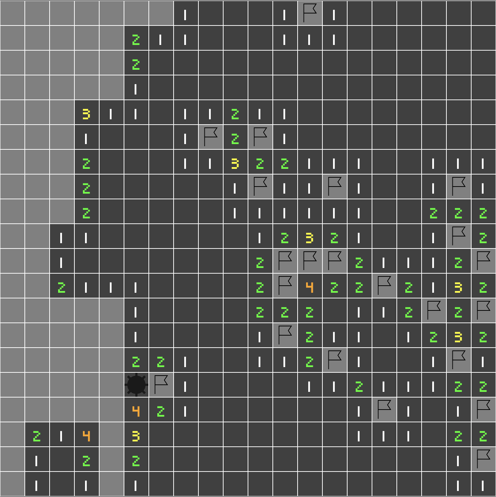

> [Check the repository](https://gitlab.com/qonfucius/minesweeper-tutorial)

# Marking tiles

Our minesweeper plugin is almost done, we still miss a very important feature: Marking tiles.
Also, you may notice that the app is quite slow, especially with large tile maps. Let's fix that first.

## Optimizations

Add the following [optimization levels](https://bevy-cheatbook.github.io/pitfalls/performance.html) in our app's `Cargo.toml`:

```toml
# Enable optimizations for dependencies (incl. Bevy), but not for our code:
[profile.dev.package."*"]
opt-level = 3

# Maybe also enable only a small amount of optimization for our code:
[profile.dev]
opt-level = 1
```

*This won't enable as many optimizations as a `release` build, but you should notice significant improvements*

## Events

To complete the gameplay we need to provide three additional events in our `board_plugin/src/events.rs`.

### Board completed event

This event will be sent at the board completion, allowing apps using our plugin to detect victory and maybe trigger some elements (victory screen, score, etc)

```rust
#[derive(Debug, Copy, Clone)]
pub struct BoardCompletedEvent;
```

### Bomb explosion event

This event will be sent every time the player uncovers a bomb, allowing apps using our plugin to detect it.
Our plugin won't interrupt the game itself, by doing an event instead we allow apps to maybe trigger loss at 3 bombs or immediately.
This method is much more modular than adding a configuration.

```rust
#[derive(Debug, Copy, Clone)]
pub struct BombExplosionEvent;
```

### Tile mark event

This event is the equivalent of `TileTriggerEvent` but for the right click.

```rust
#[derive(Debug, Copy, Clone)]
pub struct TileMarkEvent(pub Coordinates);
```

## Resources

Let's edit our `Board` resource to handle tile marking (flags):

```rust
// board.rs
use bevy::log;

#[derive(Debug)]
pub struct Board {
    // ..
    pub marked_tiles: Vec<Coordinates>,
}

impl Board {
    // ..

    /// Removes the `coords` from `marked_tiles`
    fn unmark_tile(&mut self, coords: &Coordinates) -> Option<Coordinates> {
        let pos = match self.marked_tiles.iter().position(|a| a == coords) {
            None => {
                log::error!("Failed to unmark tile at {}", coords);
                return None;
            }
            Some(p) => p,
        };
        Some(self.marked_tiles.remove(pos))
    }

    /// Is the board complete
    pub fn is_completed(&self) -> bool {
        self.tile_map.bomb_count() as usize == self.covered_tiles.len()
    }
}
```

We add:
- a new field storing the various marked coordinates
- a public method checking the board completion.
- a private method to remove coordinates from the new field

Let's edit the `tile_to_uncover`method  and check for marked tiles:

```diff
// board.rs
pub fn tile_to_uncover(&self, coords: &Coordinates) -> Option<&Entity> {
+   if self.marked_tiles.contains(coords) {
+       None
+   } else {
        self.covered_tiles.get(coords)
+   }
}
```

Instead of directly returning the covered tile entity, we check if the tile is marked. This will prevent uncovering marked tiles by clicking on it.

Let's change the `try_uncover_tile` method as well to remove the marked coordinates on uncovering.

```diff
// board.rs
pub fn try_uncover_tile(&mut self, coords: &Coordinates) -> Option<Entity> {
 +   if self.marked_tiles.contains(coords) {
 +      self.unmark_tile(coords)?;
 +  }
    self.covered_tiles.remove(coords)
}
```

We can now create the `try_toggle_mark` method:
```rust
// board.rs

    /// We try to mark or unmark a tile, returning the entity and if the tile is marked
    pub fn try_toggle_mark(&mut self, coords: &Coordinates) -> Option<(Entity, bool)> {
        let entity = *self.covered_tiles.get(coords)?;
        let mark = if self.marked_tiles.contains(coords) {
            self.unmark_tile(coords)?;
            false
        } else {
            self.marked_tiles.push(*coords);
            true
        };
        Some((entity, mark))
    }
```

## Systems

### Uncover

Let's edit our uncovering system to check for board completion.

We also need to send our new `BombExplosionEvent`.

```diff
// uncover.rs
+ use crate::{BoardCompletedEvent, BombExplosionEvent};

pub fn uncover_tiles(
    // ..
+   mut board_completed_event_wr: EventWriter<BoardCompletedEvent>,
+   mut bomb_explosion_event_wr: EventWriter<BombExplosionEvent>,
) {
    // match board.try_uncover_tile(coords) {}
    // ..
+   if board.is_completed() {
+       log::info!("Board completed");
+       board_completed_event_wr.send(BoardCompletedEvent);
+   }
    if bomb.is_some() {
        log::info!("Boom !");
-       // TODO: generate an event
+       bomb_explosion_event_wr.send(BombExplosionEvent);
    }
    //..
}
```

### Input

Let's edit our `input_handling` system and send our new event for a *right click*:

```diff
// input.rs
+ use crate::TileMarkEvent;

pub fn input_handling(
    // ..
+   mut tile_mark_ewr: EventWriter<TileMarkEvent>,
) {
    // ..
-   // TODO: generate an event
+   tile_mark_ewr.send(TileMarkEvent(coordinates));
    // ..
}
```

### Mark

Let's create a `mark` module in our plugin `systems` with a `mark_tiles` system:

```rust
// systems/mod.rs
pub mod mark;
```

```rust
// mark.rs
se crate::{Board, BoardAssets, TileMarkEvent};
use bevy::log;
use bevy::prelude::*;

pub fn mark_tiles(
    mut commands: Commands,
    mut board: ResMut<Board>,
    board_assets: Res<BoardAssets>,
    mut tile_mark_event_rdr: EventReader<TileMarkEvent>,
    query: Query<&Children>,
) {
    for event in tile_mark_event_rdr.iter() {
        if let Some((entity, mark)) = board.try_toggle_mark(&event.0) {
            if mark {
                commands.entity(entity).with_children(|parent| {
                    parent
                        .spawn_bundle(SpriteBundle {
                            texture: board_assets.flag_material.texture.clone(),
                            sprite: Sprite {
                                custom_size: Some(Vec2::splat(board.tile_size)),
                                color: board_assets.flag_material.color,
                                ..Default::default()
                            },
                            transform: Transform::from_xyz(0., 0., 1.),
                            ..Default::default()
                        })
                        .insert(Name::new("Flag"));
                });
            } else {
                let children = match query.get(entity) {
                    Ok(c) => c,
                    Err(e) => {
                        log::error!("Failed to retrieve flag entity components: {}", e);
                        continue;
                    }
                };
                for child in children.iter() {
                    commands.entity(*child).despawn_recursive();
                }
            }
        }
    }
}
```

We have familiar arguments, and a new `Query` on `Children` entities which we will use for children of *tile cover* entities (flags).

> **Note:** *This query could be optimized with a new `TileCover` component, therefore avoiding querying every entity with children*

The function iterates through our `TileMarkEvent` reader and will attempt to toggle marks on the `Board` resource.
If the tile is marked, we spawn a flag sprite, using the `BoardAssets`, otherwise we despawn all tile cover children.
We could store entity references or use a custom `Flag` component to avoid this hard despawn operation, but we won't add any other children to the tile cover entities.

## Plugin

Let's register our new events and systems:

```diff
// lib.rs

impl<T: StateData> Plugin for BoardPlugin<T> {
    fn build(&self, app: &mut AppBuilder) {
        // ..
        // We handle uncovering even if the state is inactive
        .add_system_set(
            SystemSet::on_in_stack_update(self.running_state.clone())
                .with_system(systems::uncover::uncover_tiles)
+               .with_system(systems::mark::mark_tiles), // We add our new mark system
        )
        .add_system_set(
            SystemSet::on_exit(self.running_state.clone()).with_system(Self::cleanup_board),
        )
        .add_event::<TileTriggerEvent>()
+       .add_event::<TileMarkEvent>()
+       .add_event::<BombExplosionEvent>()
+       .add_event::<BoardCompletedEvent>();
    }
}

impl<T> Board<T> {
    fn setup_board(
        // ..
    ) {
        // ..
        commands.insert_resource(Board {
            // ..
+           marked_tiles: Vec::new(),
            // ..
        })

    }
}
```

That's it ! We have a complete Minesweeper plugin !




---
Author: Félix de Maneville
Follow me on [Twitter](https://twitter.com/ManevilleF)