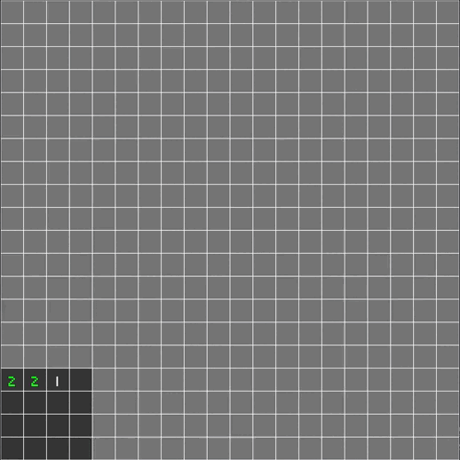
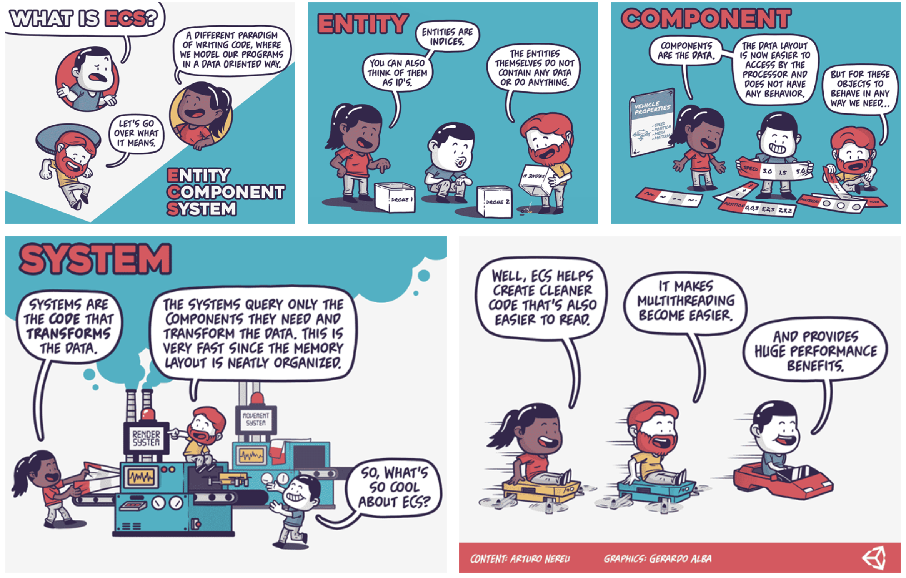

> [Check the repository](https://gitlab.com/qonfucius/minesweeper-tutorial)
> 
# Introduction

Hello, in this tutorial we will introduce game development in Rust using [Bevy](http://bevyengine.org), a free and open source data-driven game engine.

The final result of this course is a cross-platform minesweeper you can test in this [live version](https://qonfucius.gitlab.io/minesweeper-tutorial/):

## Disclaimer

The tutorial focuses on the following goals:
- Breakdown basic Bevy features and the ECS making a minesweeper
- Using development tools such as the inspector gui, the logger, etc.
- Developing a generic bevy plugin making good use of the state system and resources
- Having Web Assembly support

> The programming choices are not the most efficient but allow to fulfill the goals. For example, you may notice that the uncovering system has a 3 to 4 frames delay:
>  - frame 1: click event read and tile trigger event send
>  - frame 2: tile trigger event read and Uncover component insert
>  - frame 3: Actual uncovering
>
> There are better ways to do this but this way you learn to receive and send events, place components in order for a *system* to query it, etc.

A decent understanding of the Rust language is a prerequisite.

*Note that this is my first Bevy project, there may be improvements so trust the latest version of the code.*

## Technologies

> Why an ECS?

I have experience in game development using [Unity3D](http://unity.com) component system using C#.
It is very user-friendly, but I think Object-oriented programming is getting obsolete, and I wanted to try an Entity component system.

> Unity made an ECS, why not use it?

Unity is taking the leap towards ECS, but looking at the [documentation](https://docs.unity3d.com/Packages/com.unity.entities@0.17/manual/index.html) I found it very complex and honestly, bad.
Maybe they were forced to compromise with the existing core but it doesn't stand the comparison with Bevy's ECS.

> Why Rust?

I love the rust language, I love game dev, I wanted to try the combination.
Also, since I wanted to experiment with an ECS which is the incarnation of the *Compound VS Inheritance* pattern in game dev,
using Rust is very natural.

Furthermore, I find garbage collection to be a critical issue in game dev and Rust completely wipes it away.

## Resources

We will be using the 0.6 version of the [Bevy engine](https://bevyengine.org):

Some resources I used that you should check out:
- The [bevy cheat book](https://bevy-cheatbook.github.io/)
- The [bevy examples](https://github.com/bevyengine/bevy/tree/latest/examples#examples)
- The [bevy discord](https://discord.gg/JjZhktEHUX) where the community is very active and helpful

The assets I used are not mine, they are all free for personal use, please check the *credits*.

I suggest you follow the tutorial using a modern IDE, like Jetbrains CLion or VS Code with the *Rust* plugin.

## ECS

> So what's an Entity component system?

The Unity [documentation](https://docs.unity3d.com/Packages/com.unity.entities@0.17/manual/index.html#) has a nice graphic explanation of ECS:

It's a data-oriented coding paradigm using the following elements:
- **Entities**: representing an object via a simple identifier (usually a classic integer)
- **Components**: structures that can be attached to **entities**, containing data but no logic
- **Systems**: functions using **Component** *queries* to apply logic

The point is to apply identical logic to all *Health* components instead of applying logic to a complete object.
It is more modular and makes it easier to manage in threads.

The final element would be **Resources** which are data shared across **systems**.

---
Author: Félix de Maneville
Follow me on [Twitter](https://twitter.com/ManevilleF)