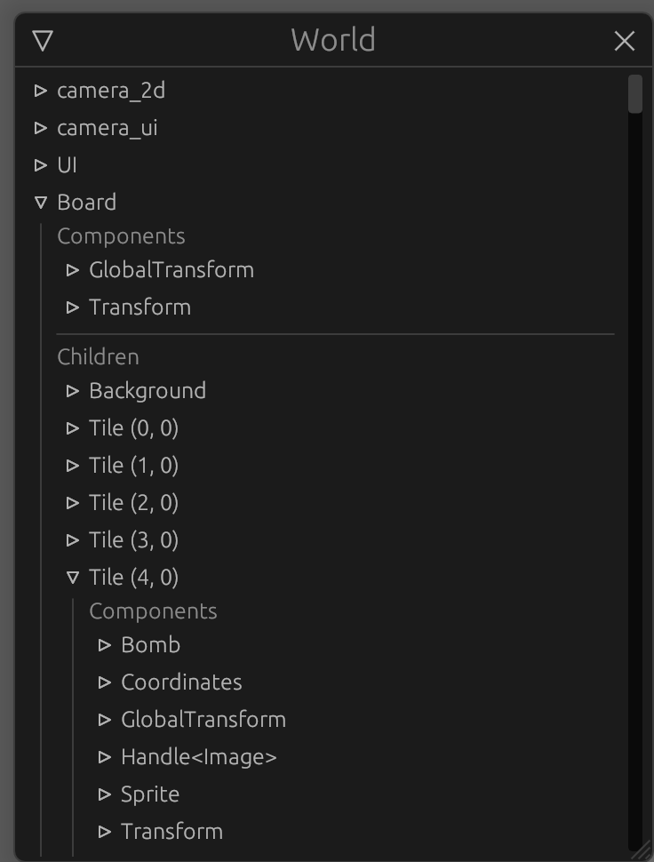

> [Check the repository](https://gitlab.com/qonfucius/minesweeper-tutorial)

# Set Up

One of the purposes of this tutorial is to create a *generic plugin* that can be embedded in any app.
To do this we will initialize **two** nested cargo projects.

## Cargo setup

The main binary app:
- `cargo init --bin . --name minesweeper-tutorial `

And the board plugin:
- `cargo init --lib board_plugin `

Your directory should look like this:

```
├── Cargo.toml
├── board_plugin
│   ├── Cargo.toml
│   └── src
│       └── lib.rs
└── src
    └── main.rs
```

## Board plugin config

### Cargo.toml

Add the following elements to the `board_plugin/Cargo.toml` file:

```toml
[features]
default = []
debug = ["colored", "bevy-inspector-egui"]

[dependencies]
# Engine
bevy = "0.6"

# Serialization
serde = "1.0"

# Random
rand = "0.8"

# Console Debug
colored = { version = "2.0", optional = true }
# Hierarchy inspector debug
bevy-inspector-egui = { version = "0.8", optional = true }
```

- [bevy](http://crates.io/crates/bevy) is the main engine dependency
- [colored](http://crates.io/crates/colored) will be used to print the board in the console in debug mode
- [bevy-inspector-egui](http://crates.io/crates/bevy-inspector-egui) so we can get the inspector compatibility for our components.

> Inspector GUI at the end of the tutorial:
>
> 

We activate the debug crates through a `debug` feature gate.

### lib.rs

Remove the generated code and create the plugin `struct`

```rust
// board_plugin/src/lib.rs
pub struct BoardPlugin;
```

## App config

### Cargo.toml

Add the following elements to the main `src/Cargo.toml` file:

```toml
[features]
default = []
debug = ["board_plugin/debug", "bevy-inspector-egui"]

[dependencies]
bevy = "0.6"
board_plugin = { path = "board_plugin" }

# Hierarchy inspector debug
bevy-inspector-egui = { version = "0.8", optional = true }

[workspace]
members = [
    "board_plugin"
]
```

We use our lib as a dependency and add it to our `workspace`.

### main.rs

Add the following to the `src/main.rs` file:

```rust
use bevy::prelude::*;

#[cfg(feature = "debug")]
use bevy_inspector_egui::WorldInspectorPlugin;

fn main() {
    let mut app = App::new();
    // Window setup
    app.insert_resource(WindowDescriptor {
        title: "Mine Sweeper!".to_string(),
        width: 700.,
        height: 800.,
        ..Default::default()
    })
    // Bevy default plugins
    .add_plugins(DefaultPlugins);
    #[cfg(feature = "debug")]
    // Debug hierarchy inspector
    app.add_plugin(WorldInspectorPlugin::new());
    // Startup system (cameras)
    app.add_startup_system(camera_setup);
    // Run the app
    app.run();
}

fn camera_setup(mut commands: Commands) {
    // 2D orthographic camera
    commands.spawn_bundle(OrthographicCameraBundle::new_2d());
}
```
Let's break it down:

- The bevy `App` is the builder for all our game logic, allowing to register *systems*, *resources* and *plugins*
- A bevy `Plugin` is a container of app building logic, a modular way to add *systems*  and *resources* to the application.

  For example, the `WorldInspectorPlugin` will register every *system* and *resource* required to display the GUI inspector.
- Bevy's `DefaultPlugins` is a collection of basic plugins providing basic engine features, like input handling, windows, transform, rendering..

We add one resource,`WindowDescriptor`to customize our window.

> How does adding resources makes anything ? They are just data !

The resources are indeed *just* data, no logic. The `DefaultPlugins` register *systems* responsible for drawing the window using the `WindowDescriptor` resource as configuration.
The resource is optional, because the systems with simply use default values if you don't set anything.

Allowing extern customization through *resources* is what we will make with our `BoardPlugin`.

#### The startup system

We also register a **Startup System**: `camera_setup`

A classic **system** is run every frame, with optional run criteria like *Stages* or *FixedTimeSteps*.
A **Startup System** is run only once, at the start.

We register systems this way:
```rust
app.add_system(my_function)
```

This is the camera setup function:

```rust
fn camera_setup(mut commands: Commands) {
    // 2D orthographic camera
    commands.spawn_bundle(OrthographicCameraBundle::new_2d());
}
```

the `Commands` argument is the main ECS tool for every system that requires world editing, it allows to spawn and despawn entities, add components to entities, insert and remove resources, etc.

> So does every system have only one argument?

Not at all, and the `Commands` argument is optional. Systems can have as many arguments as you want, but only ECS valid ones like:
- **Commands** as we just saw (`Commands`)
- **Resources** wrapped in `Res<>` or `ResMut<>` (can be assets, window or any inserted resource)
- **Component Queries** (`Query<>`)
- **Event items** (`EventReader<>` and `EventWriter<>`)
- etc.

Bevy will automatically handle everything for you and provide your systems with the correct arguments.

> The systems "spawns a bundle", what does that mean?

We explained in the [intro](./introduction.md) that in our in game world there are **Entities** with **Components** attached.

To spawn an entity and add components we can do this:

```rust
fn my_system(mut commands: Commands) {
  // This spawns an entity and returns a builder
  let entity = commands.spawn();
  // We can add components to the entity
  entity
          .insert(MyComponent {})
          .insert(MyOtherComponent {});
}
```

But for complex objects we use **Bundles** which contains a collection of *components* to add.

This way we can do:

```rust
fn my_system(mut commands: Commands) {
  let entity = commands.spawn();
  entity.insert_bundle(MyComponentBundle::new());
}
```

or directly:

```rust
fn my_system(mut commands: Commands) {
  // This spawns an entity with all components in the bundle
  commands.spawn_bundle(MyComponentBundle::new());
}
```

In our system we spawn a camera entity with all the associated components to have a 2D orthographic camera.

## Run

You can now run the app using

- `cargo run`:
  Giving you an empty window
- `cargo run --features debug`:


Showing the debug inspector, we can see our 2D camera entity, and the components inserted via the bundle.

---
Author: Félix de Maneville
Follow me on [Twitter](https://twitter.com/ManevilleF)