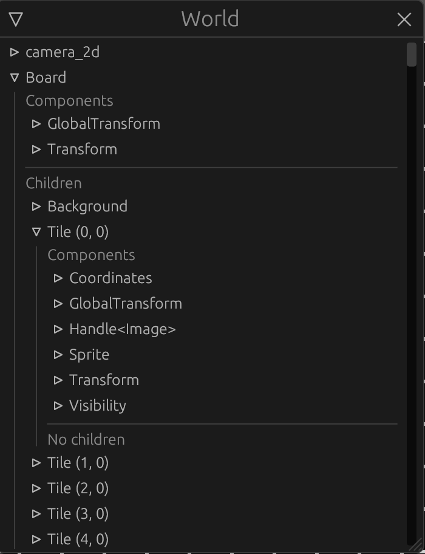

> [Check the repository](https://gitlab.com/qonfucius/minesweeper-tutorial)

# The Board

We have our tile map but still nothing on screen, let's create some tiles !

## Board options

To comply with our objective of making a completely modular plugin we must first provide generation options.
We will now create a nice configuration resource like bevy's `WindowDescriptor` we saw in [Part 1](./1_setup.md).

Create a `board_options` module in our plugin
```
├── Cargo.toml
└── src
    ├── components
    │   ├── coordinates.rs
    │   └── mod.rs
    ├── lib.rs
    └── resources
        ├── board_options.rs
        ├── mod.rs
        ├── tile.rs
        └── tile_map.rs
```

and add it to the `mod.rs` file:

```rust
// ..
pub use board_options::*;

mod board_options;
```

We want the following options:
- All tile map options (width, height and bomb count)
- Custom Padding between tile sprites
- Custom tile size or window adaptive size
- Custom board world position or window centered with optional offset
- Optional safe uncovered start zone

> That's a lot !

It is, but the more, the merrier ! Let's do this:

```rust
// board_options.rs
use bevy::prelude::Vec3;
use serde::{Deserialize, Serialize};

/// Tile size options
#[derive(Debug, Clone, Serialize, Deserialize)]
pub enum TileSize {
    /// Fixed tile size
    Fixed(f32),
    /// Window adaptative tile size
    Adaptive { min: f32, max: f32 },
}

/// Board position customization options
#[derive(Debug, Clone, Serialize, Deserialize)]
pub enum BoardPosition {
    /// Centered board
    Centered { offset: Vec3 },
    /// Custom position
    Custom(Vec3),
}

/// Board generation options. Must be used as a resource
// We use serde to allow saving option presets and loading them at runtime
#[derive(Debug, Clone, Serialize, Deserialize)]
pub struct BoardOptions {
    /// Tile map size
    pub map_size: (u16, u16),
    /// bomb count
    pub bomb_count: u16,
    /// Board world position
    pub position: BoardPosition,
    /// Tile world size
    pub tile_size: TileSize,
    /// Padding between tiles
    pub tile_padding: f32,
    /// Does the board generate a safe place to start
    pub safe_start: bool,
}
```

This seems complex but if we implement good `Default` implementations our the options will be very easy to use

```rust
// board_options.rs

impl Default for TileSize {
    fn default() -> Self {
        Self::Adaptive {
            min: 10.0,
            max: 50.0,
        }
    }
}

impl Default for BoardPosition {
    fn default() -> Self {
        Self::Centered {
            offset: Default::default(),
        }
    }
}

impl Default for BoardOptions {
    fn default() -> Self {
        Self {
            map_size: (15, 15),
            bomb_count: 30,
            position: Default::default(),
            tile_size: Default::default(),
            tile_padding: 0.,
            safe_start: false,
        }
    }
}
```

let's register our new resource to our app:

```diff
// main.rs
+ use board_plugin::resources::BoardOptions;

fn main() {
    let mut app = App::new();
    // Window setup
    app.insert_resource(WindowDescriptor {
        title: "Mine Sweeper!".to_string(),
        width: 700.,
        height: 800.,
        ..Default::default()
    })
    // Bevy default plugins
    .add_plugins(DefaultPlugins);
    #[cfg(feature = "debug")]
    // Debug hierarchy inspector
    app.add_plugin(WorldInspectorPlugin::new());
+     // Board plugin options
+     app.insert_resource(BoardOptions {
+         map_size: (20, 20),
+         bomb_count: 40,
+         tile_padding: 3.0,
+         ..Default::default()
+     })
    .add_plugin(BoardPlugin)
    // Startup system (cameras)
    .add_startup_system(camera_setup);
    // Run the app
    app.run();
}
```

## Board generation

Now that we have a generation option resource, let's use in our plugin to build our first board.
Let's edit our `create_board` startup system:

### Params and tile map

```rust
// lib.rs
use resources::BoardOptions;

// ..
pub fn create_board(
        mut commands: Commands,
        board_options: Option<Res<BoardOptions>>,
        window: Res<WindowDescriptor>,
    ) {}
```
Notice we added parameters to our system:
- `Commands` as we will spawn entities and components
- `Option<Res<BoardOption>>` is our new generation option resource, but optional !
- `Res<WindowDescriptor>` is the window configuration resource we set up in our `main.rs`

/!\ *At the time of writing this tutorial I realized that since the `WindowDescriptor` resource is optional our system will panic if no window configuration is set up.
A better practice would be to use it in an `Option<>` like our `BoardOptions` or access the `Windows` resource directly.*

Since our generation options are optional we need to use the `Default` implementation if it is not set:

```rust
// ..
let options = match board_options {
     None => BoardOptions::default(), // If no options is set we use the default one
     Some(o) => o.clone(),
};
```

We can now generate our tile map:

```rust
// ..
// Tilemap generation
let mut tile_map = TileMap::empty(options.map_size.0, options.map_size.1);
tile_map.set_bombs(options.bomb_count);
#[cfg(feature = "debug")]
// Tilemap debugging
log::info!("{}", tile_map.console_output());
```

### Tile size

We added options for the tile size, and one determining tile size according to the window.
If the option is selected we must compute the tile size between the window, and the tile map dimensions.

Add the following method to `BoardPlugin`:
```rust
// lib.rs
/// Computes a tile size that matches the window according to the tile map size
fn adaptative_tile_size(
    window: Res<WindowDescriptor>,
    (min, max): (f32, f32), // Tile size constraints
    (width, height): (u16, u16), // Tile map dimensions
) -> f32 {
    let max_width = window.width / width as f32;
    let max_heigth = window.height / height as f32;
    max_width.min(max_heigth).clamp(min, max)
}
```

Let's use it in our `create_board` system:

```rust
// lib.rs
use resources::TileSize;

// ..
// We define the size of our tiles in world space
let tile_size = match options.tile_size {
    TileSize::Fixed(v) => v,
    TileSize::Adaptive { min, max } => Self::adaptative_tile_size(
        window,
        (min, max),
        (tile_map.width(), tile_map.height()),
    ),
};
```

### Board creation

We can now compute the board *world size* and *world_position*

```rust
// lib.rs
use resources::BoardPosition;

// ..
// We deduce the size of the complete board
let board_size = Vec2::new(
    tile_map.width() as f32 * tile_size,
    tile_map.height() as f32 * tile_size,
);
log::info!("board size: {}", board_size);
// We define the board anchor position (bottom left)
let board_position = match options.position {
    BoardPosition::Centered { offset } => {
        Vec3::new(-(board_size.x / 2.), -(board_size.y / 2.), 0.) + offset
    }
    BoardPosition::Custom(p) => p,
};
```

> That's a weird computation

I make the choice here to anchor the board at the bottom left instead of the center in order to place all the tile children
in positive relative positions.


*The actual board object will be on the bottom left of the visible board*

We can now create our board:

```rust
// lib.rs
// ..
commands
            .spawn()
            .insert(Name::new("Board"))
            .insert(Transform::from_translation(board_position))
            .insert(GlobalTransform::default());
```

If we run the app we now have an empty board with three components:
- a `Name` (which will be used by the inspector GUI)
- a `Transform`, which describe its local **translation**, **scale** and **rotation**
- a `GlobalTransform` which describes the same values as `Transform` but globally

Note that we have to create both `Transform` and  `GlobalTransform` but we **never** set the global one.
If one is missing, the entire hierarchy will not behave as expected.

Let's create the Board background: Add the following to the `spawn` code

```rust
// lib.rs
// ..
    .with_children(|parent| {
                // We spawn the board background sprite at the center of the board, since the sprite pivot is centered
                parent
                    .spawn_bundle(SpriteBundle {
                        sprite: Sprite {
                            color: Color::WHITE,
                            custom_size: Some(board_size),
                            ..Default::default()
                        },
                        transform: Transform::from_xyz(board_size.x / 2., board_size.y / 2., 0.),
                        ..Default::default()
                    })
                    .insert(Name::new("Background"));
            });
```

So what is happening here:
First we use `with_children`, giving us a builder similar to `Commands` but to spawn children objects to our Board.
Then we spawn a new "Background" entity with a `SpriteBundle` (note that all built-in **Component Bundles** already have `Transform` and `GlobalTransform` components):
- `sprite`: we create a basic rectangle of the size of our board with a white color.
- `transform`: Sprite anchors are centered, since we put our board to the bottom left, we want to put this background in the center of the board.


*The background is positioned in the center*

Let's spawn the tiles !

```rust
// lib.rs
use components::Coordinates;

// ..
    .with_children(|parent| {
        
        // ..

        // Tiles
        for (y, line) in tile_map.iter().enumerate() {
                    for (x, tile) in line.iter().enumerate() {
                        parent
                            .spawn_bundle(SpriteBundle {
                                sprite: Sprite {
                                    color: Color::GRAY,
                                    custom_size: Some(Vec2::splat(
                                        tile_size - options.tile_padding as f32,
                                    )),
                                    ..Default::default()
                                },
                                transform: Transform::from_xyz(
                                    (x as f32 * tile_size) + (tile_size / 2.),
                                    (y as f32 * tile_size) + (tile_size / 2.),
                                    1.,
                                ),
                                ..Default::default()
                            })
                            .insert(Name::new(format!("Tile ({}, {})", x, y)))
                            // We add the `Coordinates` component to our tile entity
                            .insert(Coordinates {
                                x: x as u16,
                                y: y as u16,
                            });
                    }
                }
    }
```

We iterate through the tile map and spawn a new entity for each tile using a `SpriteBundle` again. We also add a `Coordinates` component for each tile.
Note that for the `z` value of the `Transform` we put `1.`, so the tile is closer to the camera than the background, and therefore printed on top of the background.

Let's run our app with the `debug` feature

`cargo run --features debug`



Our board is generated and we can observe the difference between `Transform` and `GlobalTransform`.

- Our board entity `Transform` and `GlobalTransform` are identical because this entity doesn't have a parent
- Our tiles `Transform` *translation* are relative to their parent, the board entity, giving the real *translation* in the `GlobalTransform` component.

---
Author: Félix de Maneville
Follow me on [Twitter](https://twitter.com/ManevilleF)