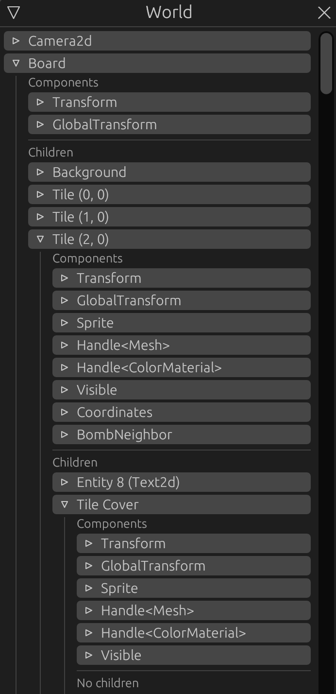
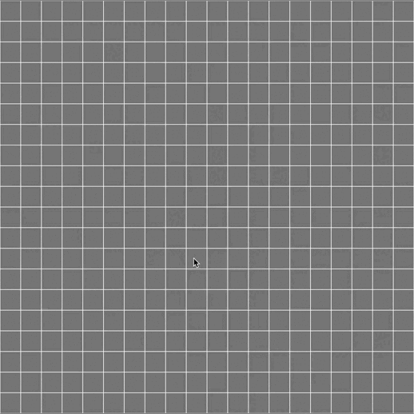

> [Check the repository](https://gitlab.com/qonfucius/minesweeper-tutorial)

# Uncovering Tiles

To cover our tiles we will simply add a child entity for each tile with a sprite, hiding what's below.
We will use the `Uncover` component set up in [part 4](./4_tiles&components.md) for uncovering.

## Board resource

To uncover the tiles we will need to store references to each covering entity, let's edit our `Board` resource:

```rust
// board.rs
use bevy::utils::HashMap;

#[derive(Debug)]
pub struct Board {
    // ..
    pub covered_tiles: HashMap<Coordinates, Entity>,
}

impl Board {
    // ..

    /// Retrieves a covered tile entity
    pub fn tile_to_uncover(&self, coords: &Coordinates) -> Option<&Entity> {
      self.covered_tiles.get(coords)
    }

    /// We try to uncover a tile, returning the entity
    pub fn try_uncover_tile(&mut self, coords: &Coordinates) -> Option<Entity> {
        self.covered_tiles.remove(coords)
    }

    /// We retrieve the adjacent covered tile entities of `coord`
    pub fn adjacent_covered_tiles(&self, coord: Coordinates) -> Vec<Entity> {
        self.tile_map
            .safe_square_at(coord)
            .filter_map(|c| self.covered_tiles.get(&c))
            .copied()
            .collect()
    }
}
```

Instead of making some complex new tile map we will use a `HashMap` containing the entities. `Entity` being a simple identifier implements `Copy` and `Clone`, so can be duplicated and stored safely.
Every time we uncover a tile we will remove the entity from our map.

We provide three methods:
- `tile_to_uncover` to retrieve a covered tile entity at some tile coordinates
- `try_uncover_tile` which removes the entity from the map if a covered tile entity exists at the given coordinates
- `adjacent_covered_tiles` which allows to retrieve all covered tile in a square around some coordinates.

## Tile cover

We edit our `spawn_tiles` function to add the following arguments:

```rust
// lib.rs
use bevy::utils::HashMap;

// ..
    fn spawn_tiles(
        // ..
        covered_tile_color: Color,
        covered_tiles: &mut HashMap<Coordinates, Entity>,
    )
// ..
```

and we can add the tile cover creation for every tile:

```rust
// lib.rs

// ..
    // .insert(coordinates);
    // We add the cover sprites
    cmd.with_children(|parent| {
                    let entity = parent
                        .spawn_bundle(SpriteBundle {
                            sprite: Sprite {
                                custom_size: Some(Vec2::splat(size - padding)),
                                color: covered_tile_color,
                                ..Default::default()
                            },
                            transform: Transform::from_xyz(0., 0., 2.),
                            ..Default::default()
                        })
                        .insert(Name::new("Tile Cover"))
                        .id();
                    covered_tiles.insert(coordinates, entity);
                });
    // match tile {
//.. 
```

----

Let's edit our `setup_board` system accordingly:

```rust
// lib.rs
use bevy::utils::{AHashExt, HashMap};

// ..
let mut covered_tiles =
            HashMap::with_capacity((tile_map.width() * tile_map.height()).into());
// ..
Self::spawn_tiles(
    //..
    Color::DARK_GRAY,
    &mut covered_tiles
);
// ..
commands.insert_resource(Board {
    //..
    covered_tiles,
})
// ..
```

Now, each *board tile* will have a child "Tile Cover" entity with a sprite hiding it.



## Events

As shown in the [previous part](./5_input&resource.md) we want to send an event when a tile is clicked.
an **event** is like a **resource** but available for 1 frame. ([see more about events](https://bevy-cheatbook.github.io/programming/events.html))

Let's create an `events.rs` module for our `board_plugin`

```rust
// board_plugin/src/events.rs
use crate::components::Coordinates;

#[derive(Debug, Copy, Clone)]
pub struct TileTriggerEvent(pub Coordinates);
```

```rust
// board_plugin/src/lib.rs
mod events;
```

Just like **components** and **resources**, **events** can be any rust type.
Here we choose to have an event containing the board coordinates of the tile to uncover.

## Systems

### Input

Let's edit our `input_handling` system and send our new event for a *left click*:

```diff
// input.rs
+ use crate::events::TileTriggerEvent;

pub fn input_handling(
    // ..
+   mut tile_trigger_ewr: EventWriter<TileTriggerEvent>,
) {
    // ..
    // log::info!("Trying to uncover tile on {}", coordinates);
-   // TODO: generate an event
+   tile_trigger_ewr.send(TileTriggerEvent(coordinates));
    // ..
}
```

We add a new argument, an `EventWriter` for our new event, and replace our *TODO* with the sending code.
Now every time we use our left mouse button on the board, a `TileTriggerEvent` is sent.

### Uncover

#### Trigger event handler

We can now create a system listening to our new event. Let's create an `uncover.rs` file in our `systems` module:

```rust
// systems/mod.rs
pub mod uncover;
```

```rust
// systems/uncover.rs
use bevy::prelude::*;
use crate::{Board, Bomb, BombNeighbor, Coordinates, Uncover};
use crate::events::TileTriggerEvent;

pub fn trigger_event_handler(
    mut commands: Commands,
    board: Res<Board>,
    mut tile_trigger_evr: EventReader<TileTriggerEvent>,
) {
    for trigger_event in tile_trigger_evr.iter() {
        if let Some(entity) = board.tile_to_uncover(&trigger_event.0) {
            commands.entity(*entity).insert(Uncover);
        }
    }
}
```

Like our input system we iterate through `TileTriggerEvent` events.
For each of these events we check if the tile is covered, and if it is we add an `Uncover` component to it.

#### Uncover tiles

Now let's make an other system using this `Uncover` component:

```rust
// uncover.rs

pub fn uncover_tiles(
    mut commands: Commands,
    mut board: ResMut<Board>,
    children: Query<(Entity, &Parent), With<Uncover>>,
    parents: Query<(&Coordinates, Option<&Bomb>, Option<&BombNeighbor>)>,
) {
    
}
```

> Our first **query** !

The arguments:
- `commands`, as usual for entity manipulation
- `board` our `Board` resource but with mutable access (`ResMut`)
- `Query<(Entity, &Parent), With<Uncover>>` : We query both `Entity` and `Parent` for every entity having an `Uncover` component.
- `Query<(&Coordinates, Option<&Bomb>, Option<&BombNeighbor>)>`: We query every `Coordinate` component and maybe `Bomb` and `BombNeighbor` components.

There are two ways to get data from queries, to *iterate* through it or to *get* the queried components from a specified entity. ([see more about queries](https://bevy-cheatbook.github.io/programming/queries.html))

Let's iterate through the `children` query:

```rust
// uncover.rs
// ..
    // We iterate through tile covers to uncover
    for (entity, parent) in children.iter() {
        // we destroy the tile cover entity
        commands
            .entity(entity)
            .despawn_recursive();
    }
```

We get every `Entity` of tile covers and the `Parent` (parent entity) from the query.
We retrieve the tile cover entity commands from `Commands` and we destroy the entity

> Why `despawn_recursive`?

This method will also despawn potential child entities and will *unlink* the tile cover from the board tile entity.

Okay, we destroy the triggered tile cover, but we need to check wich *board tile* was actually triggered, and get its coordinates.
Let's get the parent components from the second query:

```rust
// uncover.rs
use bevy::log;

// ..
    let (coords, bomb, bomb_counter) = match parents.get(parent.0) {
        Ok(v) => v,
        Err(e) => {
            log::error!("{}", e);
            continue;
        }
    };
```

We now have the *board tile* (the tile cover parent) `Coordinates` component and two `Option<>` for their potential `Bomb` and `BombNeighbor` components.

Let's complete our function:
```rust
// uncover.rs
// ..
    // We remove the entity from the board covered tile map
    match board.try_uncover_tile(coords) {
        None => log::debug!("Tried to uncover an already uncovered tile"),
        Some(e) => log::debug!("Uncovered tile {} (entity: {:?})", coords, e),
    }
    if bomb.is_some() {
        log::info!("Boom !");
        // TODO: Add explosion event
    }
    // If the tile is empty..
    else if bomb_counter.is_none() {
        // .. We propagate the uncovering by adding the `Uncover` component to adjacent tiles
        // which will then be removed next frame
        for entity in board.adjacent_covered_tiles(*coords) {
            commands.entity(entity).insert(Uncover);
        }
    }
```

Since we *despawn* the triggered cover tile entity, we need to remove it from our `Board` calling `try_uncover_tile`.
We also check if the board tile is a **bomb** and log *Boom !*.

The final part will insert a new `Uncover` component to adjacent tile covers **if** the parent *board tile* is neither a **bomb** nor a **bomb neighbor**.
This operation will propagate the uncovering process to the adjacent cover tiles for the next frame.
This is not necessarily optimal, but it *delays computations*.

All that is left is to register our new systems and our event to our `App` in `BoardPlugin`

```rust
// lib.rs
use crate::events::*;

// ..
//   .add_system(systems::input::input_handling)
    .add_system(systems::uncover::trigger_event_handler)
    .add_system(systems::uncover::uncover_tiles)
    .add_event::<TileTriggerEvent>();
//..
```

Let's run our app !



---
Author: Félix de Maneville
Follow me on [Twitter](https://twitter.com/ManevilleF)