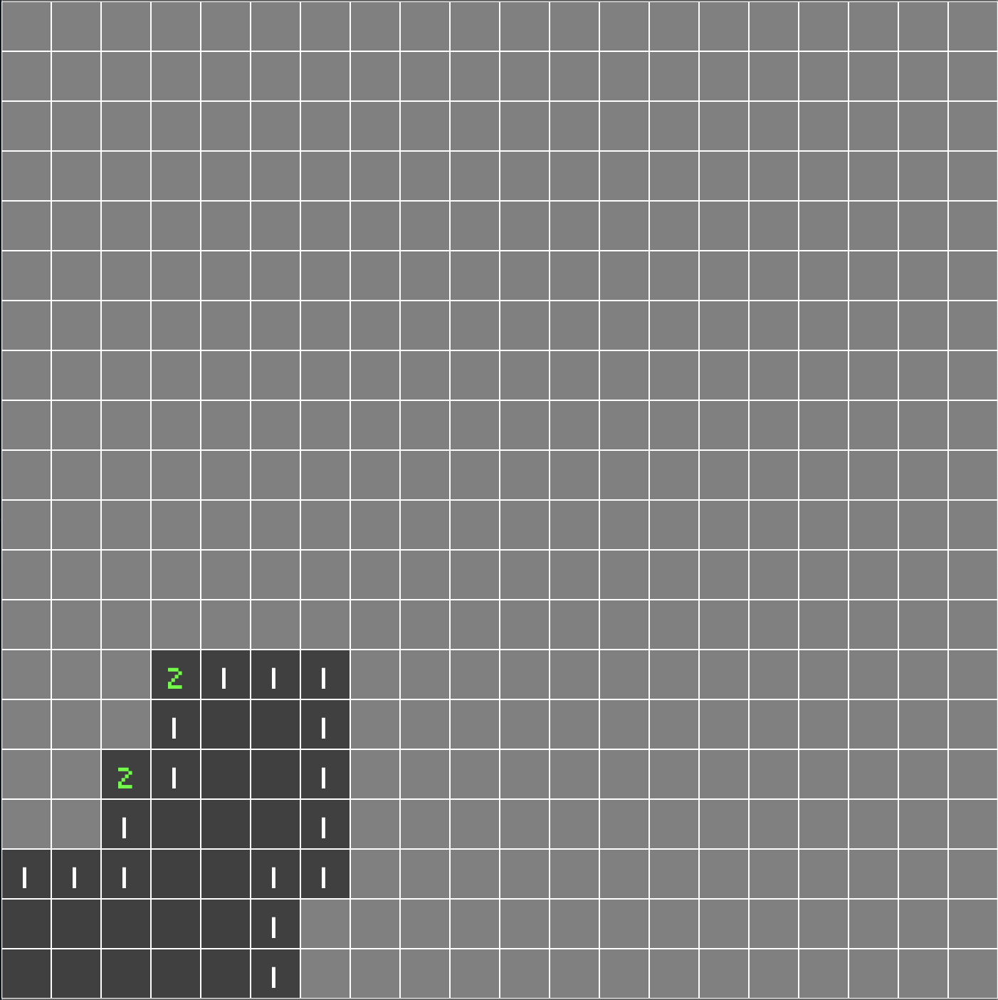

> [Check the repository](https://gitlab.com/qonfucius/minesweeper-tutorial)

# Safe Start

We can uncover tiles, but a good minesweeper should provide a *safe start* uncovered zone.
Let's activate the `BoardOptions` parameter in our `main.rs`:

```diff
// main.rs
// ..
    .insert_resource(BoardOptions {
        // ..
+        safe_start: true,
        // ..
    }
// ..
```

This option does nothing now, we need to implement it in our `board_plugin`.
We want to find an *empty* tile and schedule its tile cover for uncovering, since we already have uncovering *systems* we will just insert a `Uncover` component on it.

We need to retrieve the current `covered_tile_entity` to be able to uncover it.
Since we want only one *safe start* we will add yet again a new argument for our `spawn_tiles` function.

> Clippy already says it has too many already !

We will refactor it on part 9, let's get this working:

```diff
// lib.rs
// ..
fn spawn_tiles(
        // ..
+        safe_start_entity: &mut Option<Entity>,
    ) {
        // ..
        covered_tiles.insert(coordinates, entity);
+       if safe_start_entity.is_none() && *tile == Tile::Empty {
+         *safe_start_entity = Some(entity);
+       }
}
```

And now we change our `setup_board` startup system accordingly:

```diff
// lib.rs
// ..
+ let mut safe_start = None;
commands
     .spawn()
     .insert(Name::new("Board"))
// ..
Self::spawn_tiles(
    //..
+     &mut safe_start,
);
// ..
+ if options.safe_start {
+    if let Some(entity) = safe_start {
+        commands.entity(entity).insert(Uncover);
+    }
+ }
// ..
```

And that's it ! if we run our app, it will uncover a safe area !



*We get a pre-uncovered area*

---
Author: Félix de Maneville
Follow me on [Twitter](https://twitter.com/ManevilleF)